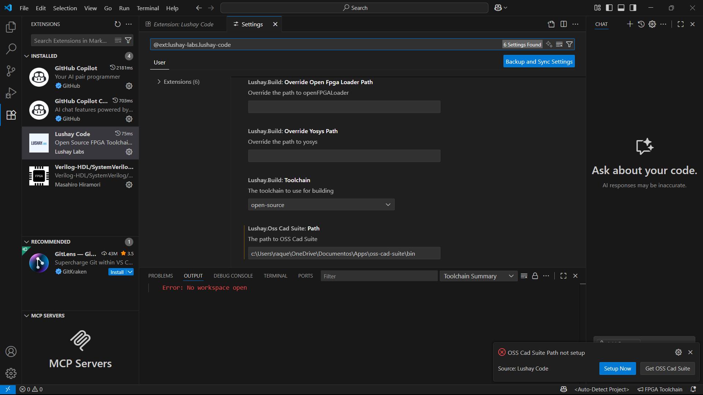
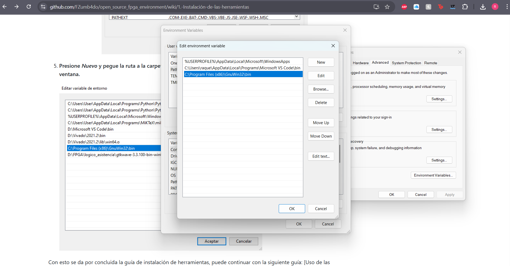
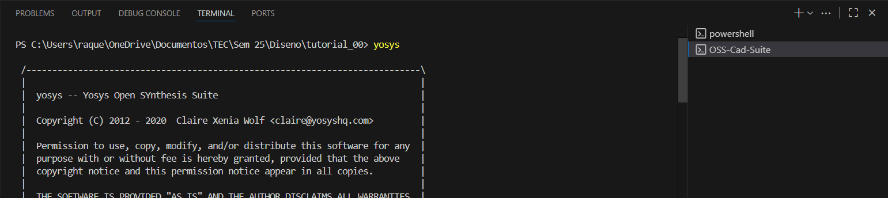
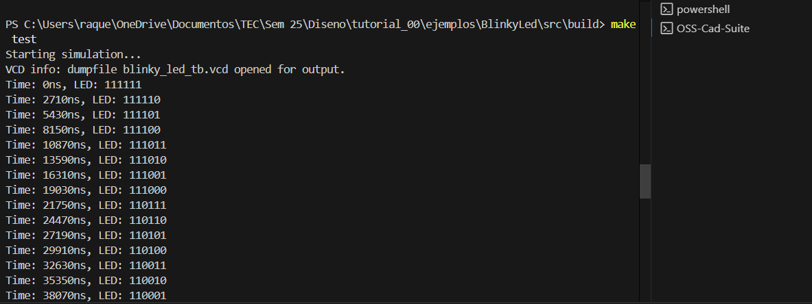
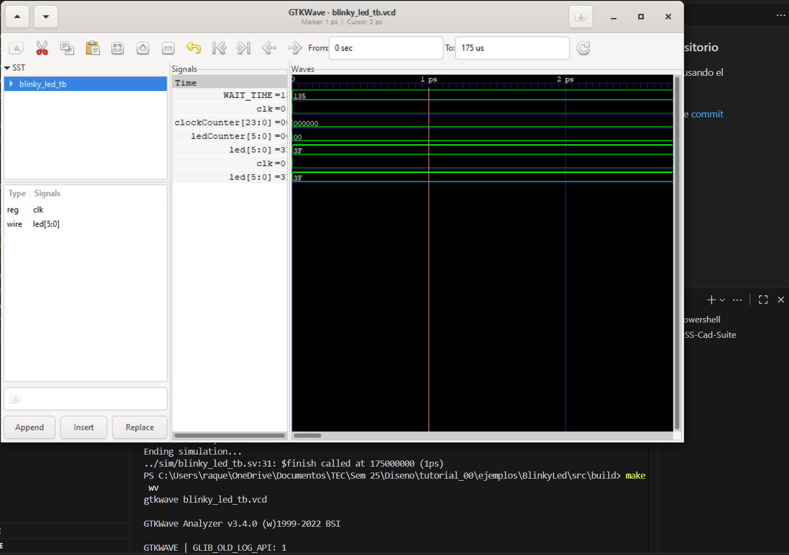
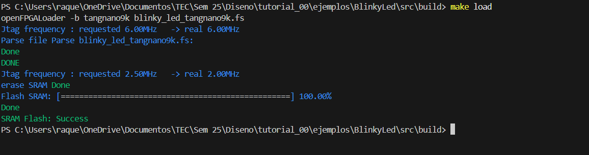
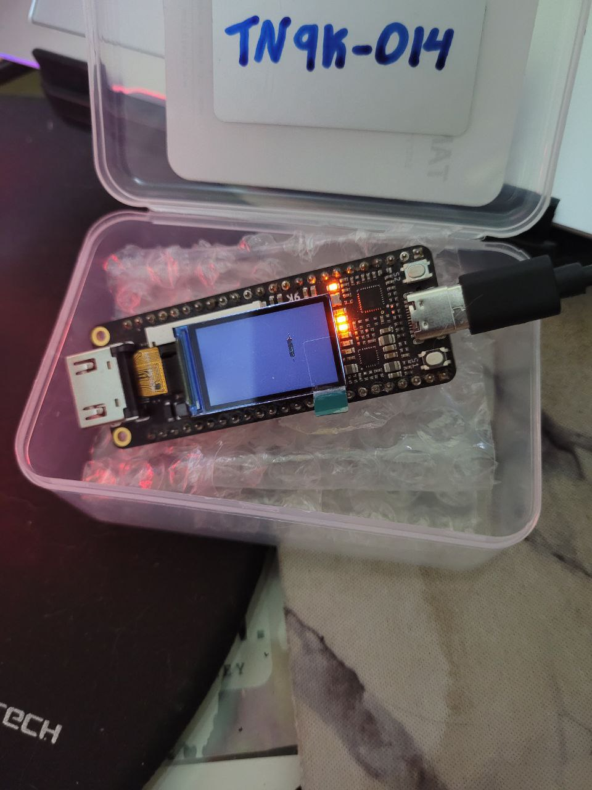
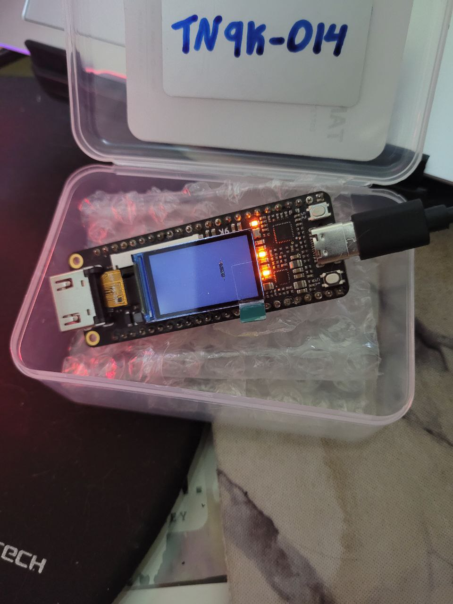

# Tutorial_00

# Seguimiento de tutorial.

## 1. Instalacion de herramientas.

### Configuracion de Lushay Code

### Configuracion de Drive USB

### Configuracion GNU-Make

## 2. Uso del toolchain para diseño en FPGA

### Clonacion de repositorio

Se clono el repositorio usando el comando `git clone`.

Evidencia en el siguiente [commit](https://github.com/raquetq/tutorial_00/commit/e61a09a99a32b3e93efcc80ed6f62a655fd57cfc)

### Uso de herramienta en VSC

### Uso basico de extension con recetas

### Visualizar diagramas de tiempo con GTKwave

### Uso de comandos para implementacion fisica

Resultado en FPGA:

